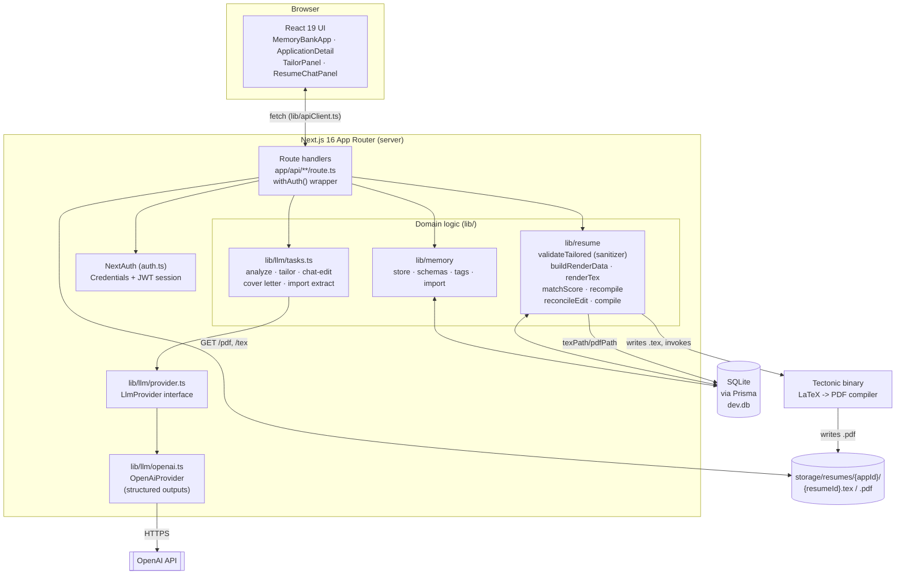
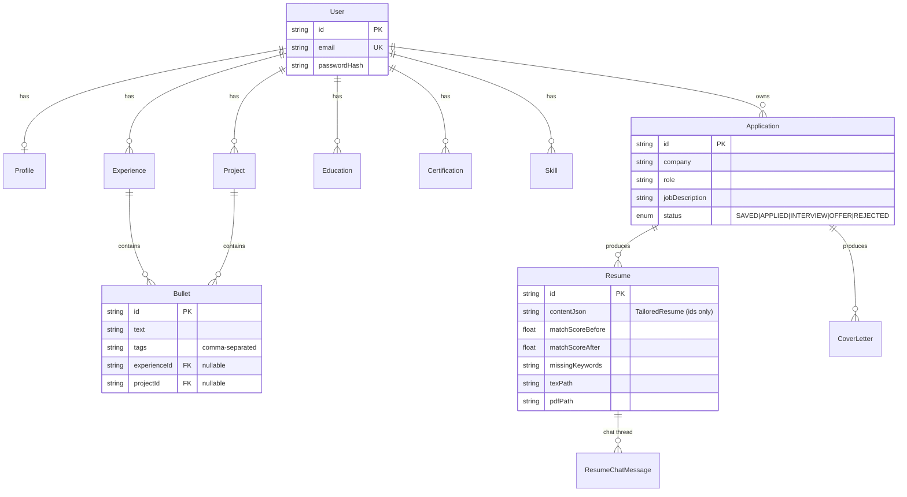
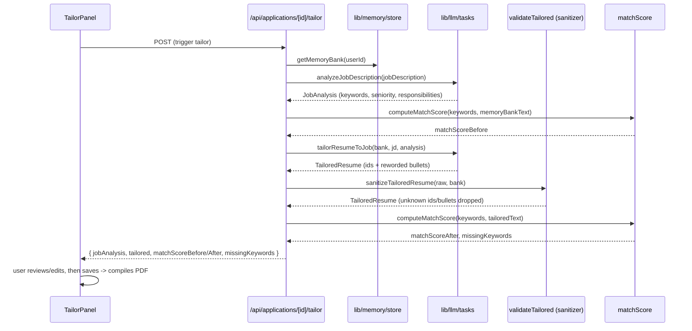
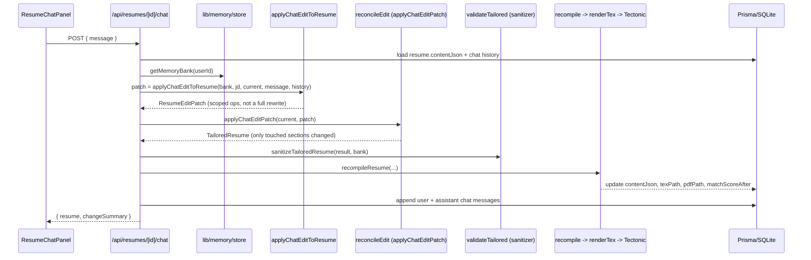

# Resume Builder

Paste a job description, get a tailored, ATS-safe resume compiled from your own **memory bank** —
a persistent record of your real experience, projects, and skills. Nothing is invented by default:
tailoring only *selects* and *lightly rewords* bullets that already exist in your memory bank, and
every generated resume is checked against that memory bank before it's ever rendered.

A cover letter generator and an iterative chat-based resume editor are also available, both grounded
in the same memory bank.

## Table of contents

- [Core idea](#core-idea)
- [Feature walkthrough](#feature-walkthrough)
- [Architecture](#architecture)
  - [System overview](#system-overview)
  - [Data model](#data-model)
  - [Tailoring pipeline](#tailoring-pipeline-post-applicationsidtailor)
  - [Chat-edit pipeline](#chat-edit-pipeline-post-apiresumesidchat)
  - [Anti-hallucination guardrail](#anti-hallucination-guardrail)
- [Tech stack](#tech-stack)
- [Project structure](#project-structure)
- [Setup](#setup)
- [Notes](#notes)

## Core idea

Most "AI resume" tools either generate text from scratch (which invents accomplishments) or just
reformat what you paste in. This app instead treats your career history as **structured, factual
data** — a memory bank of profile info, work experience, projects, education, certifications, and
individually tagged bullet points — and treats *tailoring* as a constrained selection/rewording
problem over that data, never a free-form generation problem.

Every LLM call that touches resume content is given the candidate's real records with **stable
IDs**, instructed to only reference those IDs, and its output is then run through a **sanitizer**
that structurally drops anything that doesn't correspond to a real ID before it's ever rendered or
saved. See [Anti-hallucination guardrail](#anti-hallucination-guardrail).

## Feature walkthrough

1. **Memory bank** (`/memory`) — your source of truth: profile, work experience, projects,
   education, certifications, skills. Paste an existing resume at `/memory/import` to bootstrap it
   in minutes (an LLM extracts structured entries, but you review/edit everything before it's
   saved).
2. **New application** (`/applications/new`) — paste a job description and company/role.
3. **Tailor** — the JD is parsed for real keywords, seniority, and responsibilities, then your
   memory bank is matched and reworded against it. You see a before/after keyword match score and
   can edit anything before compiling.
4. **Compile** — the tailored resume is rendered to LaTeX and compiled to a real PDF via
   [Tectonic](https://tectonic-typesetting.github.io/). Download the PDF, or the `.tex` source to
   keep polishing in Overleaf.
5. **Chat-edit** (`ResumeChatPanel`) — tell the assistant what to change in plain language
   ("lead with the leadership project", "drop the internship", "tighten the summary"). Each turn
   emits a small *patch*, not a full rewrite, is applied on top of the current draft, and
   recompiles the PDF in place. Full conversation history is kept per resume.
6. **Cover letter** — generated per application from the same job description + memory bank.
7. **Track** (`/applications`) — every application keeps its JD, tailored resume(s), status
   (Saved → Applied → Interview → Offer/Rejected), and notes together.

## Architecture

### System overview



**Request path**: the browser calls JSON route handlers under `app/api/`, each wrapped in
`withAuth()` (`lib/api.ts`) which resolves the NextAuth session and enforces per-user ownership
(`lib/resume/ownership.ts`) before touching any data. Route handlers are thin — they orchestrate
calls into `lib/memory`, `lib/resume`, and `lib/llm`, which hold the actual domain logic. There's no
separate backend: everything runs inside the Next.js server process, backed by a local SQLite file
(`dev.db`, via Prisma) and a `storage/` directory for compiled artifacts.

### Data model



`Profile`/`Experience`/`Project`/`Education`/`Certification`/`Skill`/`Bullet` are the **memory
bank** — the only place factual content lives. A `Resume.contentJson` never duplicates that text;
it stores a `TailoredResume` (see `lib/resume/tailoredSchema.ts`) that references memory-bank
**IDs** plus lightly-reworded bullet text, so the renderer always resolves company/title/dates from
the real `Experience`/`Project` row, never from LLM output.

### Tailoring pipeline (`POST /applications/[id]/tailor`)



### Chat-edit pipeline (`POST /api/resumes/[id]/chat`)



The chat model never returns a full resume — it returns a **patch** describing only what this turn
intentionally changes (`experienceOps`, `projectOps`, `headline.changed`, ...). `reconcileEdit.ts`
applies that patch on top of the previous draft, so anything not mentioned is left byte-for-byte
unchanged — the model has no way to accidentally rewrite unrelated sections.

### Anti-hallucination guardrail

Every content-producing LLM call is constrained two ways, defense-in-depth:

1. **Prompt-level**: system prompts in `lib/llm/tasks.ts` require every `id`/`bulletId` to exactly
   match a real memory-bank record and forbid inventing employers, titles, dates, or accomplishments.
2. **Structural-level**: `lib/resume/validateTailored.ts` re-checks the LLM's output against the
   actual memory bank afterwards — any experience/project/bullet ID that doesn't exist, or any skill
   not present in the bank, is dropped before rendering. Company/title/dates are never taken from
   LLM output at all; `buildRenderData.ts` always looks them up from the real `Experience`/`Project`
   row by ID.

The one opt-in exception is the chat editor: setting `ALLOW_FABRICATED_RESUME_CONTENT=true` lets it
add explicitly-requested embellishments under an *existing real* experience/project ID (it still
can never invent a whole employer). This is off by default — the initial tailor pass and manual
edits are always fully grounded regardless of this setting.

## Tech stack

| Layer | Choice |
| --- | --- |
| Framework | [Next.js 16](https://nextjs.org/) (App Router, React 19, Turbopack) |
| Auth | [NextAuth v5](https://authjs.dev/) (Credentials provider, JWT sessions, bcrypt password hashing) |
| Database | SQLite via [Prisma ORM 7](https://www.prisma.io/) (`@prisma/adapter-better-sqlite3`) |
| LLM | OpenAI structured outputs (`lib/llm/provider.ts` is an interface, so swapping providers means implementing one class) |
| Validation | [Zod 4](https://zod.dev/) schemas for LLM I/O, API input, and the memory bank |
| PDF rendering | Resume data → LaTeX (`renderTex.ts`) → [Tectonic](https://tectonic-typesetting.github.io/) → PDF |
| Styling | Tailwind CSS 4 |

## Project structure

```text
app/
  (app)/                 Authenticated pages: dashboard, memory bank, applications
  api/                   Route handlers (auth, signup, memory, profile, applications, resumes)
  login/, signup/        Public auth pages
auth.ts                  NextAuth configuration
components/
  applications/          ApplicationDetail, TailorPanel, ResumeChatPanel, CoverLetterPanel, ResumeList
  memory/                MemoryBankApp and per-section editors (Experience, Project, Skills, ...)
  ui/                    Small shared UI primitives
lib/
  llm/                   Provider abstraction (provider.ts), OpenAI impl, task prompts, Zod schemas
  memory/                Memory-bank Prisma access, Zod schemas, tag parsing, resume-import schema
  resume/                Sanitizer, LaTeX/PDF pipeline, match scoring, chat-patch reconciliation
  auth/, session.ts      Auth helpers
  api.ts, apiClient.ts   Server-side withAuth() wrapper / client-side fetch helper
  db.ts                  Prisma client singleton
prisma/
  schema.prisma          Data model (see Data model diagram above)
  migrations/             
storage/                 Generated .tex/.pdf output (git-ignored)
tools/tectonic/          Vendored Tectonic binary (git-ignored)
```

## Setup

```bash
npm install
npx prisma migrate dev   # creates dev.db
```

Copy `.env.example` to `.env` if you don't already have one, and fill in:

- `OPENAI_API_KEY` — required for JD analysis, tailoring, resume import, chat edits, and cover
  letters.
- `AUTH_SECRET` — session signing secret (a default is pre-filled for local dev; replace it for
  anything beyond your own machine).
- `TECTONIC_BIN` — path to the Tectonic binary used to compile PDFs. Already vendored at
  `tools/tectonic/tectonic.exe` for this machine. If that binary is missing (e.g. on a fresh clone
  — it's git-ignored because it's a 50MB executable), download it from the
  [Tectonic releases page](https://github.com/tectonic-typesetting/tectonic/releases) for your
  platform and point `TECTONIC_BIN` at it, or install the `tectonic` package via your OS package
  manager.
- `ALLOW_FABRICATED_RESUME_CONTENT` — defaults to unset (guardrail on). The initial per-application
  tailor pass and manual resume edits always stay grounded in your memory bank regardless of this
  setting — it only affects the resume chat editor. Set to `"true"` to let the chat add skills or
  bullet content you explicitly ask for even if it's not backed by anything in your memory bank (it
  still can't invent a whole new employer/title/dates, since those always come from a real
  memory-bank entry). This makes the resume dishonest if you use it for accomplishments you didn't
  actually do — leave it unset unless you specifically want that.

Then:

```bash
npm run dev
```

Open <http://localhost:3000>, sign up, and add a few entries to your memory bank before tailoring
your first application — tailoring has nothing to work with on an empty account.

## Notes

- Multiple people can use the same deployment — each account has its own isolated memory bank and
  applications (enforced at the query layer via `lib/resume/ownership.ts`).
- The first PDF compile downloads LaTeX packages on demand (cached afterwards by Tectonic), so it
  can take longer than later ones.
- Generated PDFs/`.tex` files live under `storage/` (git-ignored) and `dev.db` is your local
  SQLite database (also git-ignored).
